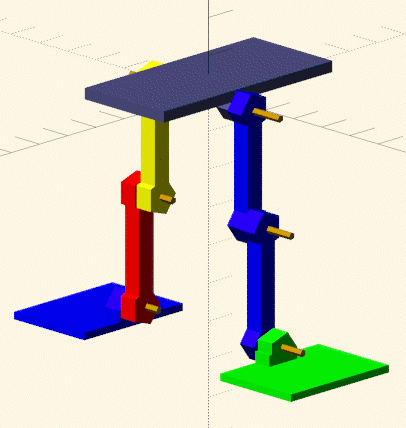

# scad2urdf

Takes a robot model from an [OpenSCAD](https://openscad.org/) file
annotated with special comments, and emits a
[URDF](https://en.wikipedia.org/wiki/URDF) model for simulation.

Python 3; depends on PyMeshLab.

